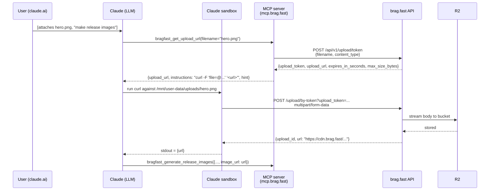

# feat: Token-upload flow for claude.ai sandbox attachments

## Overview

Add a Pixa-style, single-domain, token-authenticated multipart upload path to `bragfast_get_upload_url` so Claude's sandbox (claude.ai, Claude Desktop, Claude Cowork) can `curl` an attached file directly to `brag.fast`. This eliminates the current "ask the user to re-host on Dropbox" workaround that is the only way to get a file attached in claude.ai into a bragfast slide today.

The change is additive. Claude Code with `file_path`, and any caller with `source_url`, keep today's MCP-server-side upload path unchanged. Only the existing "no file provided" branch of `bragfast_get_upload_url` changes behavior.

## Problem Frame

When a user attaches an image or MP4 in a claude.ai conversation, the file lives at `/mnt/user-data/uploads/…` inside Claude's execution sandbox. The hosted MCP server (`mcp.brag.fast`) cannot read that path — it is not part of the MCP server's filesystem. Today's code detects the `/mnt/user-data/` prefix and rejects it with instructions to re-host the file somewhere public (`src/tools/upload-image.ts:52`, `src/tools/get-upload-url.ts:73`). Tool descriptions and the guided prompt reinforce that workaround (`src/server.ts:367`, `src/server.ts:422`, `src/server.ts:499`). The workaround is friction: users have to stop, upload to Dropbox, generate a direct-download link, paste it back.

Pixa MCP solves the same class of problem by returning an upload URL that the sandbox `curl`s itself:

```
POST https://api.pixa.com/developer/v1/media/upload-by-token?upload_token=<token>
Content-Type: multipart/form-data
  file=@<local_file_path>
```

Single domain, single-use token, 15-minute TTL, multipart POST (which sandbox `curl` handles reliably). The user whitelists one domain in claude.ai → Settings → Capabilities → Network Egress and the flow works for every subsequent attachment.

The current `bragfast_get_upload_url` already has a no-file branch, but it returns a raw R2 presigned PUT URL (`*.r2.cloudflarestorage.com`) — a different hostname per bucket, not easily whitelist-able in claude.ai, and requires raw PUT rather than multipart POST. The no-file branch is effectively dead code for sandbox callers today.

## Requirements Trace

- R1. A user can attach an image or MP4 in claude.ai chat and have it land in bragfast without any re-hosting step.
- R2. Claude Code's current fast path (server-side `fetch` + direct R2 PUT for `file_path`, server-side fetch + upload for `source_url`) continues to work with no regression.
- R3. The upload URL returned for sandbox callers points at a single, user-whitelist-able domain on `brag.fast`.
- R4. Upload tokens are short-lived, single-use, and bound to filename + content-type so a leaked token cannot be repurposed.
- R5. Failure modes (expired token, oversized file, sandbox not allowlisted) produce actionable error messages the LLM can surface to the user.
- R6. Tool descriptions stop asserting "attachments don't work" once the new path exists.

## Scope Boundaries

- No change to `bragfast_generate_release_images` / `bragfast_generate_release_video` input shape. Uploads keep flowing as URLs, not asset IDs (`src/lib/types.ts`).
- No change to the Claude Code + `file_path` server-side upload path (`src/tools/get-upload-url.ts:70-145`).
- No change to the `source_url` server-side download + re-upload path.
- No change to `chunked-upload.ts`. Its threshold (4 MB) and behavior stay identical.
- No removal of `bragfast_upload_image`; base64 path stays for small pasted screenshots.

### Deferred to Separate Tasks

- **Backend `/upload/token` + `/upload/by-token` endpoints on brag.fast** — owned by the brag.fast API repo, not this repo. Contract specified below under "Key Technical Decisions" and appended to `presigned-upload-prd.md` as part of Unit 1. MCP code (Unit 2) is inert until the backend ships.
- **Asset-ID model** — Pixa has `asset_id`. Bragfast stays URL-based; adopting asset IDs is not worth the churn and is out of scope.
- **Sandbox-driven chunked upload for >4 MB files over the token path** — if backend cannot lift the body cap, large videos fall back to today's `source_url` workflow. Revisit only if that turns out to be a common case.

## Context & Research

### Relevant Code and Patterns

- `src/tools/get-upload-url.ts` — owner of the current no-file branch (`src/tools/get-upload-url.ts:147-158`) that this plan replaces; also owns the server-side upload decision tree that stays unchanged.
- `src/tools/upload-image.ts:52-59` — `/mnt/user-data/` rejection pattern. Reuse the same rejection shape in the tool description rewrite so messages stay consistent.
- `src/tools/chunked-upload.ts:34-70` — reference for how this repo models a multi-step upload (init → parts → complete → abort). Not reused, but the abort/complete response shape informs the token-curl response fields.
- `src/lib/api-client.ts:69-85` — `client.post` is sufficient for calling the new `/upload/token` endpoint (Bearer auth, JSON body). No new transport helper needed.
- `src/server.ts:108-114, 363-373, 418-427, 459-549` — every tool description string and the guided prompt that reference the attachment limitation. All must be updated in sync so the LLM does not receive contradictory guidance.
- `__tests__/api-client.test.ts:22-107` — vitest pattern for this repo: `vi.stubGlobal("fetch", …)`, mock `resolveApiKey`, build responses via a `makeResponse` helper. Tests for the new branch should follow this idiom.
- `__tests__/generate-images.test.ts:6-10` — alternative pattern: construct the client, then `client.post = vi.fn()` and mock per-test. Lighter touch for tool-layer tests.

### Institutional Learnings

- `docs/solutions/` does not exist in this repo. No prior captured learnings.
- `presigned-upload-prd.md` at repo root is the de-facto design doc for the existing presigned flow. Its "Client compatibility" table (`presigned-upload-prd.md:201-205`) already anticipated claude.ai whitelisting but the implementation landed as server-side PUT instead. Unit 1 extends that PRD rather than creating a new one.
- Recent commits tell a story of back-and-forth on this exact tension: `c8162df` added a multipart POST fallback when direct PUT fails (network block); `88f990b` added chunked upload for >4 MB; `d0f7340` removed R2 framing from descriptions; `a88c217` clarified attachment limitations and video presets. The token-curl path is the piece that closes the loop on the claude.ai use case those commits were circling around.

### External References

- Pixa MCP `upload` tool with `method: upload_url` (user-supplied reference in session). Nanoid-style token in query param, 15-minute TTL, multipart POST with `file` field, response carries `asset_id`. Bragfast mirrors the shape but returns `{ upload_id, url }` to stay consistent with existing endpoints.
- No additional external research needed. The pattern is well-established (S3 pre-signed POST, Cloudflare R2 proxy via Worker, etc.) and the Pixa reference is sufficient prior art.

## Key Technical Decisions

- **Two-endpoint split on the backend.** `POST /api/v1/upload/token` mints; `POST /api/v1/upload/by-token` consumes. Mirrors the existing `/upload/presigned` + `/upload/:id` split so the API team has a clear precedent. Keeping them separate is what makes the consume URL safe to hand to a sandbox: it carries its own auth (token in query) and does not need a Bearer header.

  **Mint request** (auth: Bearer):
  ```json
  { "filename": "hero.png", "content_type": "image/png" }
  ```
  **Mint response (201):**
  ```json
  {
    "upload_token": "utk_<nanoid>",
    "upload_url": "https://brag.fast/api/v1/upload/by-token?upload_token=utk_<nanoid>",
    "expires_in_seconds": 900,
    "max_size_bytes": 4194304
  }
  ```
  **Consume request** (no Bearer): `POST {upload_url}`, body: `multipart/form-data` with field `file`.
  **Consume response (200):**
  ```json
  { "upload_id": "upl_<nanoid>", "url": "https://cdn.brag.fast/uploads/...", "size_bytes": 245123 }
  ```

- **Single domain: `brag.fast` (apex, matching `BRAGFAST_API_URL` in `src/lib/api-client.ts:4`).** One user-whitelist entry covers this flow plus every other `/api/v1/*` call the MCP already makes. No new DNS, no per-bucket R2 hostname surfacing to the sandbox.

- **Token semantics.**
  - 15-minute TTL — matches Pixa, long enough for a human to act if the LLM pauses, short enough that leaked tokens age out.
  - Single use — server marks consumed on first 2xx. Replay returns 404.
  - Content-type and filename frozen at mint time — consume endpoint rejects mismatches. Prevents a token issued for `foo.png` from being used to upload `evil.exe`.
  - Size cap enforced at consume time, not just declared — backend streams body with a counter and aborts past the cap.

- **Body-size cap: 4 MB for the token path in v1.** Vercel (current hosting for the main brag.fast API) enforces a 4.5 MB request body cap on serverless routes (see comment at `src/tools/get-upload-url.ts:95-97`). We declare `max_size_bytes: 4194304` in the mint response, document this in the MCP tool description, and direct larger-file callers to `source_url`. A follow-up can migrate `/upload/by-token` to a Cloudflare Worker that streams directly to R2 without the cap; tracked as a backend-only change that does not alter the MCP contract.

- **No changes to MCP transport helpers.** `client.post<T>` handles mint (Bearer + JSON). The consume call is never made by the MCP server — the sandbox does it. No new `postMultipartNoAuth` helper.

- **LLM never needs the raw token.** The MCP returns a full `upload_url` (with the token embedded as a query param) plus a ready-to-paste `instructions` string. The LLM passes that string to its shell. Minimizes chances of the LLM reassembling URLs incorrectly.

- **Keep the three-return-type union.** `getUploadUrl` already returns one of three shapes depending on branch (`PresignedUploadResult + upload_commands`, `UploadResult`, `{ url }`). The no-file branch return becomes a fourth variant: `TokenUploadResult`. Callers in `src/tools/upload-image.ts:70-74` only look for `"url" in result`, which stays correct (the new variant has no `url`, signaling "upload not yet performed").

- **No dedicated new tool.** Reuse `bragfast_get_upload_url` because (a) it is already the tool description LLMs are trained to invoke for uploads, (b) adding a 9th tool would dilute the surface, (c) the branching is a natural dispatch on "did the caller give me a file, or do they want a URL to curl themselves?"

## Open Questions

### Resolved During Planning

- Replace the dead R2 presigned-URL no-file branch vs. keep both? → **Replace.** The R2 URL no-file branch cannot succeed in claude.ai sandbox; keeping it is a trap for the LLM.
- New tool or overload existing? → **Overload `bragfast_get_upload_url`.** Decision rationale in Key Technical Decisions.
- Token in query or header? → **Query.** Matches Pixa; lets sandbox use plain `curl -F` without `-H 'Authorization: …'` gymnastics; query-param tokens on single-use short-TTL URLs are a well-understood pattern.
- Body cap value? → **4 MB for v1.** Matches existing Vercel cap; documented in response payload and tool description.

### Deferred to Implementation

- Exact shape of the MCP `TokenUploadResult` union addition: whether to inline the fields or wrap under a `mode: "token_upload"` discriminant. Decide at coding time — both serialize fine to MCP JSON; discriminant is nicer if a third caller is ever added.
- Whether to include `expires_at` (absolute) in addition to `expires_in_seconds` (relative). Lean toward adding both so the LLM can surface an accurate local time in user-facing messages without math. Confirm when writing the code.
- Whether to move the 4 MB threshold into a shared constant (there is already `CHUNK_SIZE_THRESHOLD` at `src/tools/chunked-upload.ts:4`). Cosmetic; defer.

## High-Level Technical Design

> *This illustrates the intended approach and is directional guidance for review, not implementation specification. The implementing agent should treat it as context, not code to reproduce.*

Sequence for the new claude.ai attachment path. Server-side Claude Code paths are unchanged and not depicted.



Decision matrix for `bragfast_get_upload_url` dispatch:

| Caller provides           | Branch taken                                          | Where upload happens           |
|--------------------------|-------------------------------------------------------|--------------------------------|
| `file_path`              | Read buffer → chunked OR presigned PUT OR multipart   | MCP server (unchanged)          |
| `source_url`             | Server fetch → chunked OR presigned PUT OR multipart  | MCP server (unchanged)          |
| `filename` only (new)    | Mint token → return curl instructions                 | Claude sandbox (new path)       |
| Nothing                  | Error: filename required                              | — (same as today)               |

## Implementation Units

- [x] **Unit 1: Extend `presigned-upload-prd.md` with the token-upload contract**

**Goal:** Capture the two new backend endpoints (`/upload/token` mint, `/upload/by-token` consume) as an appended section to the existing PRD so the brag.fast API team has a single source of truth matching what the MCP will call.

**Requirements:** R1, R3, R4, R5

**Dependencies:** None

**Files:**
- Modify: `presigned-upload-prd.md`

**Approach:**
- Append a new `## Token Upload (claude.ai sandbox path)` section after the existing Security Requirements.
- Include the mint and consume endpoint specs (request/response bodies, status codes, error cases) as captured in Key Technical Decisions above.
- Note the 4 MB v1 size cap and the future-Worker migration path explicitly so backend reviewers see the trade-off.
- Add a one-line note to the existing "MCP Integration" section cross-referencing the new flow.

**Patterns to follow:**
- `presigned-upload-prd.md:21-69` formatting (three tables per endpoint: request body, response body, error responses).
- `presigned-upload-prd.md:142-162` signing/TTL narrative style.

**Test scenarios:**
- Test expectation: none — documentation-only change. Reviewable by the brag.fast API owner.

**Verification:**
- PRD reviewed and approved by the brag.fast API team.
- Backend team confirms the contract is implementable on either Vercel (4 MB cap) or a Cloudflare Worker (no cap, future work).

---

- [x] **Unit 2: Add token-upload response branch to `getUploadUrl`**

**Goal:** When `bragfast_get_upload_url` is called with only `filename` (no `file_path`, no `source_url`), return a Pixa-shaped payload that the sandbox can `curl` directly to `brag.fast`.

**Requirements:** R1, R3, R4, R5

**Dependencies:** Unit 1 (PRD contract); backend `/upload/token` endpoint live in whichever environment the MCP is pointed at (production or staging). MCP can be merged independently once the contract is final, but the feature is inert until the backend ships.

**Files:**
- Modify: `src/tools/get-upload-url.ts`
- Test: `__tests__/get-upload-url.test.ts` (new file — see Unit 3)

**Approach:**
- Add a new `TokenUploadResult` interface in `src/tools/get-upload-url.ts` matching the mint response plus a computed `instructions` curl string and a user-facing `hint` string:
  - Fields: `upload_token`, `upload_url`, `expires_in_seconds`, `max_size_bytes`, `method: "POST"`, `content_type: "multipart/form-data"`, `instructions`, `hint`.
  - `instructions` format: `curl -X POST -F 'file=@<local_file_path>' '<upload_url>'` — the `<local_file_path>` placeholder is intentional so the LLM substitutes the attachment's actual path.
  - `hint` format: `If curl fails with 'host_not_allowed' or 403, ask the user to add 'brag.fast' to Settings → Capabilities → Network Egress → Additional allowed domains.`
- Extend the return-type union at `src/tools/get-upload-url.ts:62-66` to include `TokenUploadResult`.
- Replace the existing no-file branch at `src/tools/get-upload-url.ts:147-158`:
  - Call `client.post<MintResponse>("/upload/token", { filename, content_type })`.
  - Assemble `instructions` and `hint` strings from the mint response.
  - Return the combined `TokenUploadResult`.
  - Remove the current `curlCommand` / `pythonCommand` construction that points at the raw R2 URL — that branch is dead in claude.ai and misleading for the LLM.
- Leave everything in the "file provided" branch (`src/tools/get-upload-url.ts:70-145`) untouched. Chunked upload, direct R2 PUT, and multipart POST fallback all continue to work.
- Update the JSDoc on `getUploadUrl` to reflect all four branches.

**Patterns to follow:**
- `src/tools/get-upload-url.ts:103-106` for calling the API client.
- `src/tools/chunked-upload.ts` for how to shape a response object that communicates a multi-step upload in a single return value.

**Test scenarios:**
- Happy path: caller passes `filename: "hero.png"`, no file fields; MCP calls `/upload/token`; returned payload contains the mint response fields plus correctly-formatted `instructions` and `hint`.
- Happy path (video): caller passes `filename: "demo.mp4"`; mint is called with `content_type: "video/mp4"`; returned payload uses the mint's `max_size_bytes`.
- Error path: `filename` omitted entirely → unchanged behavior (schema validation catches it at the MCP tool layer; existing `getContentType` throws on missing extension).
- Error path: unsupported extension (`filename: "doc.pdf"`) → existing `getContentType` throws `Unsupported file type: .pdf`.
- Error path: backend returns 429 → existing `handleResponse` surfaces `Rate limited. Try again in X seconds` — verify the new branch propagates that.
- Integration: `instructions` string is valid shell (single-quoted, no unescaped special chars in `upload_url`).

**Verification:**
- `npm test` green.
- Manual call against staging: `client.post("/upload/token", …)` returns the expected shape; MCP payload round-trips to an MCP client.

---

- [x] **Unit 3: Tests for `getUploadUrl` token branch and regression coverage**

**Goal:** Cover the new branch and add a safety net around the existing branches (currently untested) so future refactors cannot silently break Claude Code.

**Requirements:** R2, R4, R5

**Dependencies:** Unit 2

**Files:**
- Create: `__tests__/get-upload-url.test.ts`

**Approach:**
- Follow the `__tests__/api-client.test.ts` pattern: mock `resolveApiKey`/`deleteCredentials` at top-level, `vi.stubGlobal("fetch", …)`, use a `makeResponse` helper.
- Test suite per branch: token-upload (new), presigned-PUT success, presigned-PUT network failure → multipart fallback, presigned-PUT HTTP-error (no fallback), chunked for >4 MB. Use a small in-memory Buffer for the file-provided cases; do not touch the filesystem.
- Sandbox-path guard: assert that `file_path: "/mnt/user-data/foo.png"` throws the documented error.
- MIME dispatch: assert `.mp4` → `video/mp4`, `.svg` → `image/svg+xml`, `.gif` → rejection.

**Patterns to follow:**
- `__tests__/api-client.test.ts:22-107` for `fetch` stubbing and error-path coverage.
- `__tests__/generate-images.test.ts:6-10` for client-level method mocking when the full transport stack is not needed.

**Test scenarios:**
- Happy path (new): token-upload branch returns `upload_url`, `instructions`, `hint`.
- Happy path (regression): presigned-PUT flow returns `{ upload_id, url, status }`.
- Edge case: exactly 4 MB buffer (boundary of `CHUNK_SIZE_THRESHOLD`) stays on presigned-PUT path; 4 MB + 1 goes chunked.
- Edge case: `file_path` starting with `/mnt/user-data/` throws immediately without calling the API.
- Error path: presigned-PUT fetch throws `TypeError` → multipart fallback is called.
- Error path: presigned-PUT returns HTTP 500 → error rethrown, no fallback.
- Error path: mint call returns 429 → propagated error message matches what `handleResponse` emits.
- Integration: schema-level `filename` validation (handled at MCP layer, so only lightly tested here).

**Verification:**
- `npm test` reports all new tests green; total test count increases from 37 to at least 45.

---

- [x] **Unit 4: Update tool descriptions and guided prompt**

**Goal:** Remove "attachments don't work" absolutism from every LLM-facing string and replace with guidance that teaches Claude to use the new token-curl path for claude.ai attachments. Stop leaking R2 framing.

**Requirements:** R1, R6

**Dependencies:** Unit 2 (behavior must exist before the description advertises it). These two units can land in the same PR; do not ship Unit 4 alone.

**Files:**
- Modify: `src/server.ts`

**Approach:**
- **`bragfast_generate_release_video` description (`src/server.ts:108-114`):** Replace the sentence "the MCP server uploads directly to R2 and returns the hosted URL to use as video_url" with "the MCP server returns a hosted URL to use as video_url" (strip "directly to R2" — residual leak from before `d0f7340`).
- **`bragfast_upload_image` description (`src/server.ts:363-373`):** Soften the blanket "Attachments don't work" statement. New framing: "Files attached in claude.ai live in a sandbox the MCP server cannot read directly — use `bragfast_get_upload_url` with just `filename` to get a curl command the sandbox can run on the attached file. Do not pass `/mnt/user-data/` paths as `file_path`." Keep the `file_base64 <4MB` guidance intact.
- **`bragfast_get_upload_url` description (`src/server.ts:418-427`):** Expand the "Omit both" line from "not recommended — may be blocked in sandboxed environments" to the actual flow: "Omit both `file_path` and `source_url` to get a single-use upload URL the sandbox can `curl` directly. Pass just `filename`. The response includes an `instructions` curl command and an `upload_url` on `brag.fast` — if curl returns `host_not_allowed`, ask the user to whitelist `brag.fast` in Settings → Capabilities → Network Egress."
- **Guided prompt step 1.3 (`src/server.ts:495-502`):** Rewrite the seven bullet list. Key changes:
  - Drop "Attachments don't work" bullet.
  - Replace "In claude.ai with a local file? Cannot read local files. Ask the user to upload to Dropbox/WeTransfer/Google Drive" with: "In claude.ai with an attached file (or a local file in the sandbox): call `bragfast_get_upload_url` with just `filename`, then run the returned `instructions` curl in the sandbox. Use the returned `url` as `image_url` / `video_url`. If the curl fails with `host_not_allowed`, ask the user to whitelist `brag.fast`."
  - Keep the Dropbox / source_url bullet as a fallback for >4 MB files.
  - Remove the "Last resort only" bullet — it described the now-deleted presigned-R2 curl path.

**Patterns to follow:**
- `src/server.ts:363-373` existing description structure (title line, then bulleted input modes, then warnings) — keep the same rhythm.
- `src/server.ts:418-427` warning-as-callout style for the `host_not_allowed` hint.

**Test scenarios:**
- Test expectation: none — prose change with no behavioral logic. Covered by visual review and by Unit 3's happy-path tests that exercise the behavior the prose describes.

**Verification:**
- Read each edited string inline; confirm no remaining references to "Attachments don't work" as an absolute, no remaining references to R2 as a user-facing concept, no remaining references to "presigned URL + curl/python commands" that pointed at the old dead branch.
- End-to-end smoke (see Unit 5).

---

- [ ] **Unit 5: End-to-end smoke verification**

**Goal:** Confirm the four scenarios in the requirements trace hold against a real backend before the PR merges.

**Requirements:** R1, R2, R3, R4, R5, R6

**Dependencies:** Backend `/upload/token` + `/upload/by-token` endpoints live on whichever environment is being tested. Units 2 and 4 merged on a branch.

**Files:**
- Test: manual — not a vitest file.

**Approach:**
- Run the MCP locally (`npm run build && npm run serve`) pointed at a backend that has the new endpoints, or connect the staging MCP in a claude.ai session.
- Execute each test scenario below against the live system.

**Test scenarios:**
- **Claude Code regression (R2):** `bragfast_get_upload_url` with `file_path: <abs path to PNG ≤4 MB>` → returns `{ upload_id, url }`. Render succeeds.
- **Claude Code regression (R2):** `bragfast_get_upload_url` with `file_path: <abs path to MP4 >4 MB>` → chunked path returns `{ upload_id, url }`.
- **source_url regression (R2):** `bragfast_get_upload_url` with `source_url: <public PNG URL>` → server-side fetch + upload returns `{ upload_id, url }`.
- **claude.ai attached image (R1, R3):** attach a ≤4 MB PNG in chat, prompt "make release images." Verify the assistant calls `bragfast_get_upload_url` with only `filename`, receives the token payload, executes the curl against `brag.fast`, and feeds the returned `url` into `bragfast_generate_release_images`.
- **claude.ai attached video (R1, R3):** same with a ≤4 MB MP4.
- **Token expiry (R4):** mint a token, wait 16 minutes, execute curl → expect 410 (or 404, per backend choice). Verify MCP error message is actionable.
- **Token single-use (R4):** execute curl twice with the same token → second call 404. Verify MCP/LLM surfaces the error rather than silently re-using.
- **Size cap (R4, R5):** mint for a 10 MB file → backend rejects either at mint (if `size_bytes` is checked) or at consume. Verify error message points at `source_url` as the alternative.
- **Allowlist failure (R5):** fresh claude.ai session without `brag.fast` whitelisted → sandbox curl returns `host_not_allowed`. Verify the MCP's `hint` string has already been surfaced to the user by the LLM.

**Verification:**
- All nine scenarios produce the expected outcome. Any failure blocks the merge.

## System-Wide Impact

- **Interaction graph:** `bragfast_get_upload_url` → `client.post("/upload/token", …)` is a new outbound call. The sandbox curl is not an MCP call at all — it lives outside the interaction graph and its success/failure reaches the MCP only via the LLM re-prompting. No change to `bragfast_upload_image` call graph. No change to `/cook` / `bragfast_generate_release_*` pipelines.
- **Error propagation:** Mint errors (429, 401, 500, network) surface through `handleResponse` in `src/lib/api-client.ts:6-29` — no new code needed. Consume errors happen in the sandbox and surface as `curl` non-zero exit / HTTP error JSON → the LLM reads and relays. The MCP does not see them.
- **State lifecycle risks:** Single-use + TTL on the backend side is the sole state. No client-side state. If the sandbox curl fails after consume started but before response reached the LLM, the token is spent; the user has to call `bragfast_get_upload_url` again. Acceptable — mint is cheap.
- **API surface parity:** Tool descriptions and the guided prompt must move together (Unit 4). Do not merge Unit 2 alone or the LLM will have new behavior with old instructions.
- **Integration coverage:** Unit 3 covers the MCP side. Backend-side coverage is in the brag.fast repo and out of scope here.
- **Unchanged invariants:** `ObjectModification.image_url` / `.video_url` still flow as URL strings (`src/lib/types.ts:26-27`). `bragfast_upload_image` tool shape unchanged. `/upload`, `/upload/presigned`, `/upload/chunked/*` endpoints unchanged. Env var `BRAGFAST_API_URL` unchanged.

## Risks & Dependencies

| Risk | Mitigation |
|------|------------|
| Backend body-size cap (Vercel 4.5 MB) blocks larger videos over the token path. | v1 declares `max_size_bytes: 4 MB` and the MCP description tells Claude to fall back to `source_url` for larger files. Follow-up migrates `/upload/by-token` to a Cloudflare Worker; no MCP contract change needed when that lands. |
| Leaked `upload_token` reused by an attacker. | Single-use + 15-minute TTL + filename/content-type binding at mint. Token is not durable credentials; compromise is bounded to one file of one type. Log token creation + consumption on the backend for audit. |
| Sandbox allowlist blocks `brag.fast`. | `hint` string in the response teaches Claude to surface the whitelist instruction. This is the same friction Pixa ships with; users whitelist once per environment and it sticks. |
| LLM garbles the `instructions` curl (e.g. shell-quoting the wrong path). | Template the curl with a clearly-placeholder `<local_file_path>` token; description instructs the LLM to substitute, not rewrite. Unit 3 asserts the assembled string parses cleanly through `/bin/sh -n`. |
| Merge of Unit 2 without Unit 4 produces stale LLM guidance. | Ship both units in one PR. Document this dependency in the unit list above. |
| Backend endpoint ships incompatibly with the PRD. | Unit 1 (PRD) is the contract. Require brag.fast team sign-off before Unit 2 lands. |

## Documentation / Operational Notes

- `README.md` does not currently describe `bragfast_get_upload_url` in detail; no update required, but if the table at `README.md:66-78` is refreshed in a future pass, include the new no-file branch.
- Backend team will own any docs/changelog entry for the new API endpoints.
- No new env vars, no new hosts outside `brag.fast`, no new permissions. Claude.ai users who have already whitelisted `brag.fast` for the existing MCP call will see the new flow work immediately.
- Rollout: can ship dark (Unit 2 merged but backend 404s) — the MCP surfaces the backend error directly, which is acceptable as an interim state. Cleaner: land backend → land MCP in that order.

## Sources & References

- Origin context (in-session): Pixa MCP upload flow documentation supplied by the user in the invoking message.
- Existing design doc: `presigned-upload-prd.md`
- Related commits: `a88c217` (attachment limitation clarifications, 3 video presets), `65ffecf` (claude.ai large-file guidance), `d0f7340` (remove presigned R2 framing), `88f990b` (chunked upload), `c8162df` (multipart POST fallback).
- Related code: `src/tools/get-upload-url.ts`, `src/tools/upload-image.ts`, `src/tools/chunked-upload.ts`, `src/lib/api-client.ts`, `src/server.ts`, `src/lib/types.ts`.
- Test patterns: `__tests__/api-client.test.ts`, `__tests__/generate-images.test.ts`.
